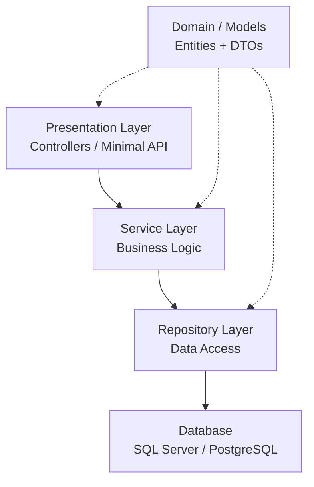

N-Layered architecture is probably the first pattern you encountered as a .NET developer.
It is everywhere — legacy codebases, tutorials, enterprise projects. Before you move to Clean
Architecture or Vertical Slicing, you need to truly understand this one. Not just follow it
blindly, but know *why* it exists, *where* it holds up, and *when* it starts hurting you.

## Why it exists — the real problem it solves

Imagine you join a project. The codebase is a single Web project. Controllers query the
database directly. Business logic lives inside `if` blocks in action methods. A bug in the
billing calculation forces you to touch the same file that renders the invoice HTML. A new
developer breaks payment logic while fixing a UI label.

That's spaghetti. N-Layered architecture exists to prevent exactly this.

The idea is simple: split responsibilities into horizontal layers that can only talk to the
layer directly below them. Each layer has one job.

It gives you:
1. **Separation of concerns** — UI code never touches the database directly
2. **Testability** — business logic is isolated and can be unit tested without spinning up HTTP
3. **Replaceability** — swap Entity Framework for Dapper without touching your service layer

## Overview — the layers



| Layer | Responsibility | Typical contents |
|---|---|---|
| Presentation | Handle HTTP, map DTOs, return responses | Controllers, Minimal API endpoints |
| Service | Orchestrate business rules | `OrderService`, `InvoiceService` |
| Repository | Abstract data access | `IOrderRepository`, EF Core / Dapper impl |
| Domain/Models | Shared contracts | Entities, DTOs, Enums, Interfaces |

## Each layer in detail

### Domain / Models — the shared contract

This is not really a "layer" in the strict sense — it is a shared project that everyone
references. Keep it lean: entities, DTOs, enums, and repository/service interfaces.

```csharp
// Domain/Entities/Order.cs
public class Order
{
    public Guid Id { get; init; }
    public string CustomerId { get; init; } = default!;
    public List<OrderLine> Lines { get; init; } = new();
    public OrderStatus Status { get; init; }
    public decimal Total => Lines.Sum(l => l.Quantity * l.UnitPrice);
}

// Domain/DTOs/CreateOrderRequest.cs
public record CreateOrderRequest(
    string CustomerId,
    List<OrderLineDto> Lines
);
```

> 💡 **Info** — DTOs travel between layers. Entities live in the database. Never return a raw
> EF entity from a controller — you risk exposing internal fields and breaking your API contract
> the moment your schema changes.

---

### Repository Layer — data access only

The repository pattern wraps your data access technology. The interface lives in Domain;
the implementation lives in Infrastructure.

```csharp
// Domain/Interfaces/IOrderRepository.cs
public interface IOrderRepository
{
    Task<Order?> GetByIdAsync(Guid id, CancellationToken ct = default);
    Task<IReadOnlyList<Order>> GetByCustomerAsync(string customerId, CancellationToken ct = default);
    Task AddAsync(Order order, CancellationToken ct = default);
    Task SaveChangesAsync(CancellationToken ct = default);
}

// Infrastructure/Repositories/OrderRepository.cs
public class OrderRepository : IOrderRepository
{
    private readonly AppDbContext _db;

    public OrderRepository(AppDbContext db) => _db = db;

    public async Task<Order?> GetByIdAsync(Guid id, CancellationToken ct = default)
        => await _db.Orders
            .AsNoTracking()
            .Include(o => o.Lines)
            .FirstOrDefaultAsync(o => o.Id == id, ct);

    public async Task<IReadOnlyList<Order>> GetByCustomerAsync(
        string customerId, CancellationToken ct = default)
        => await _db.Orders
            .AsNoTracking()
            .Where(o => o.CustomerId == customerId)
            .ToListAsync(ct);

    public async Task AddAsync(Order order, CancellationToken ct = default)
        => await _db.Orders.AddAsync(order, ct);

    public Task SaveChangesAsync(CancellationToken ct = default)
        => _db.SaveChangesAsync(ct);
}
```

> ✅ **Good practice** — Always use `AsNoTracking()` for read-only queries. EF Core won't
> track the entity in the change tracker, which reduces memory overhead and speeds up reads.

> ❌ **Never do this** — Don't expose `IQueryable<T>` from your repository interface.
> It leaks your ORM abstraction upward and makes your service layer dependent on EF Core internals.

---

### Service Layer — business logic lives here

This is where your rules live. Not in controllers, not in repositories. The service
receives a request, validates it, applies business rules, calls the repository, and returns
a result.

```csharp
// Application/Services/OrderService.cs
public class OrderService
{
    private readonly IOrderRepository _orders;
    private readonly ILogger<OrderService> _logger;

    public OrderService(IOrderRepository orders, ILogger<OrderService> logger)
    {
        _orders = orders;
        _logger = logger;
    }

    public async Task<Guid> CreateOrderAsync(
        CreateOrderRequest request, CancellationToken ct = default)
    {
        if (!request.Lines.Any())
            throw new ValidationException("An order must have at least one line.");

        var order = new Order
        {
            Id = Guid.NewGuid(),
            CustomerId = request.CustomerId,
            Status = OrderStatus.Pending,
            Lines = request.Lines.Select(l => new OrderLine
            {
                ProductId = l.ProductId,
                Quantity = l.Quantity,
                UnitPrice = l.UnitPrice
            }).ToList()
        };

        await _orders.AddAsync(order, ct);
        await _orders.SaveChangesAsync(ct);

        _logger.LogInformation("Order {OrderId} created for customer {CustomerId}",
            order.Id, order.CustomerId);

        return order.Id;
    }
}
```

> ⚠️ **It works, but...** — Throwing `ValidationException` directly in the service is
> acceptable for simple cases. In larger codebases, consider the Result pattern to avoid
> using exceptions for control flow. See the Error Handling series for a deep dive.

---

### Presentation Layer — thin controllers only

Controllers should be thin. Their only job: receive the HTTP request, call the service,
map the result to an HTTP response. Zero business logic here.

```csharp
// Api/Controllers/OrdersController.cs
[ApiController]
[Route("api/[controller]")]
public class OrdersController : ControllerBase
{
    private readonly OrderService _orderService;

    public OrdersController(OrderService orderService)
        => _orderService = orderService;

    [HttpPost]
    [ProducesResponseType(typeof(CreateOrderResponse), StatusCodes.Status201Created)]
    [ProducesResponseType(StatusCodes.Status400BadRequest)]
    public async Task<IActionResult> CreateOrder(
        [FromBody] CreateOrderRequest request, CancellationToken ct)
    {
        var orderId = await _orderService.CreateOrderAsync(request, ct);
        return CreatedAtAction(nameof(GetOrder), new { id = orderId },
            new CreateOrderResponse(orderId));
    }

    [HttpGet("{id:guid}")]
    public async Task<IActionResult> GetOrder(Guid id, CancellationToken ct)
    {
        var order = await _orderService.GetOrderAsync(id, ct);
        return order is null ? NotFound() : Ok(order);
    }
}
```

> ✅ **Good practice** — Use `CancellationToken` in every async controller action and pass it
> all the way down to the database call. When a user cancels their request or a load balancer
> times out, EF Core will cancel the query rather than letting it run to completion for nothing.

---

### Solution structure
MyApp.sln
├── src/
│   ├── MyApp.Api/              ← Presentation (Controllers, Program.cs, DI setup)
│   ├── MyApp.Application/      ← Services (business logic)
│   ├── MyApp.Infrastructure/   ← Repositories, EF Core, external integrations
│   └── MyApp.Domain/           ← Entities, DTOs, Interfaces (no dependencies)
└── tests/
├── MyApp.Application.Tests/
└── MyApp.Infrastructure.Tests/

> 💡 **Info** — `MyApp.Domain` should have **zero** external NuGet dependencies. If you find
> yourself adding EF Core or any framework package to Domain, something is wrong with your
> dependency direction.

---

## Where N-Layered starts hurting

This architecture works very well for small to medium applications. It starts showing cracks
when your codebase grows:

- **Anemic services** — You end up with a `ProductService` that has 25 methods, one per use
  case. It becomes impossible to navigate.
- **Fat repositories** — Repositories accumulate custom query methods until they become
  unmaintainable.
- **Cross-feature coupling** — Adding a new feature requires touching every layer, every time.

This is not a reason to avoid N-Layered — it is a signal to evolve. The natural next step is
Clean Architecture (which enforces dependency direction) or Vertical Slicing (which organizes
by feature instead of by layer).

## Wrap-up

You now understand what N-Layered architecture is, how each layer relates to the others, and
how to implement it correctly in a real .NET solution. You can structure a new project from
scratch, keep controllers thin, isolate business logic in services, and abstract data access
behind repository interfaces.

Ready to level up your next project or share it with your team? See you in the next one — Clean
Architecture is waiting.

## References

- [Common web application architectures — Microsoft Learn](https://learn.microsoft.com/en-us/dotnet/architecture/modern-web-apps-azure/common-web-application-architectures)
- [N-tier architecture style — Azure Architecture Center](https://learn.microsoft.com/en-us/azure/architecture/guide/architecture-styles/n-tier)
- [ASP.NET Core fundamentals — Microsoft Learn](https://learn.microsoft.com/en-us/aspnet/core/fundamentals/)
- [Entity Framework Core — Microsoft Learn](https://learn.microsoft.com/en-us/ef/core/)