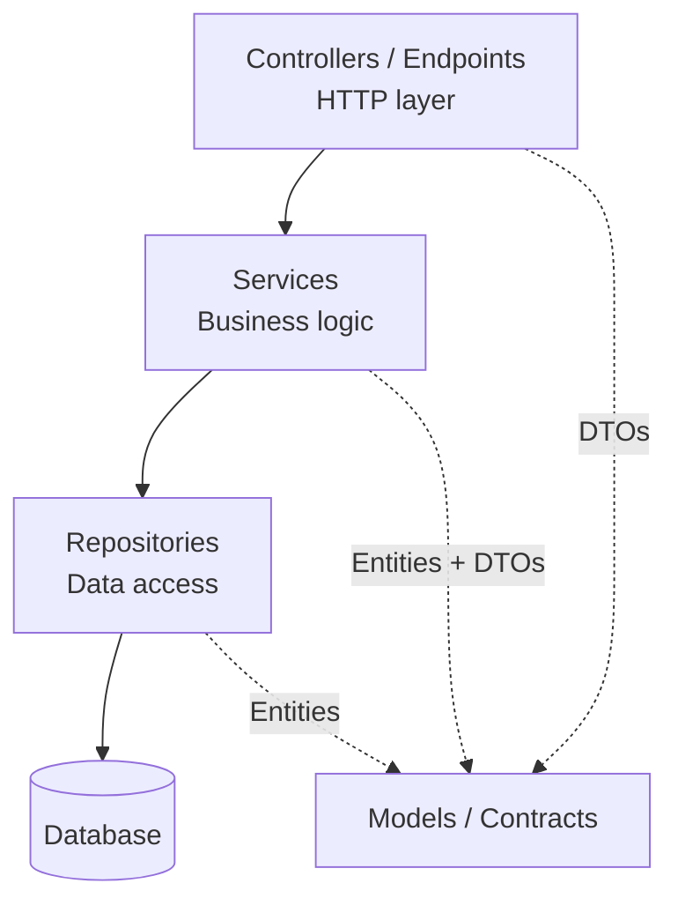

Before Clean Architecture became a buzzword and before Vertical Slicing showed up on every conference stage, there was a humbler pattern that quietly shipped thousands of .NET applications: **UI, Services, Repositories**. Three folders, three responsibilities, one project. If you have ever opened a mid-sized ASP.NET Core codebase, odds are this is what you found.

It is not the same thing as N-Layered architecture, even though people use the terms interchangeably. N-Layered is about *physical* separation into projects with enforced dependency rules. UI / Repos / Services is about *logical* separation inside a single project. It is lighter, faster to set up, and perfectly fine for a huge class of applications. It also has very specific failure modes you need to recognize before they rot your codebase.

## Why this pattern exists

Picture a small team building an internal tool. A single ASP.NET Core project, maybe 30 endpoints, one database. Spinning up four csproj files, wiring solution references, and arguing about whether `AutoMapper` belongs in Infrastructure or Application is overkill. What the team actually needs is:

1. **A place for HTTP concerns** so controllers stay readable.
2. **A place for business logic** so you stop debugging across six files to understand one rule.
3. **A place for data access** so swapping a query does not require touching the UI.

Three folders. Three suffixes. Done. That is the whole pitch: just enough structure to stop the rot, not so much that it slows delivery.

## Overview: the three buckets



| Folder | Role | Typical files |
|---|---|---|
| `Controllers/` | Receive HTTP, validate shape, call a service | `OrdersController.cs` |
| `Services/` | Orchestrate business rules, call repositories | `OrderService.cs`, `IOrderService.cs` |
| `Repositories/` | Abstract the database | `OrderRepository.cs`, `IOrderRepository.cs` |
| `Models/` | Entities, DTOs, enums | `Order.cs`, `CreateOrderRequest.cs` |

Everything lives in one project. No solution gymnastics, no circular reference headaches, no hour-long debates about where `ILogger` extensions belong.

## Each piece in detail

### Solution layout inside a single project

```
MyApp.Api/
├── Controllers/
│   └── OrdersController.cs
├── Services/
│   ├── IOrderService.cs
│   └── OrderService.cs
├── Repositories/
│   ├── IOrderRepository.cs
│   └── OrderRepository.cs
├── Models/
│   ├── Entities/
│   │   └── Order.cs
│   └── Dtos/
│       ├── CreateOrderRequest.cs
│       └── OrderResponse.cs
├── Data/
│   └── AppDbContext.cs
└── Program.cs
```

> 💡 **Info** : This is not "wrong because it is one project". Thousands of production apps run this way. The rule you enforce with folders and interfaces, not with csproj boundaries.

### Repositories: the data access seam

A repository is a boring class that wraps EF Core (or Dapper) and exposes methods named after use cases, not SQL. The interface is what the rest of the app depends on.

```csharp
// Repositories/IOrderRepository.cs
public interface IOrderRepository
{
    Task<Order?> GetByIdAsync(Guid id, CancellationToken ct = default);
    Task<IReadOnlyList<Order>> GetPendingForCustomerAsync(string customerId, CancellationToken ct = default);
    Task AddAsync(Order order, CancellationToken ct = default);
    Task<int> SaveChangesAsync(CancellationToken ct = default);
}

// Repositories/OrderRepository.cs
public sealed class OrderRepository : IOrderRepository
{
    private readonly AppDbContext _db;

    public OrderRepository(AppDbContext db) => _db = db;

    public Task<Order?> GetByIdAsync(Guid id, CancellationToken ct = default) =>
        _db.Orders
            .AsNoTracking()
            .Include(o => o.Lines)
            .FirstOrDefaultAsync(o => o.Id == id, ct);

    public Task<IReadOnlyList<Order>> GetPendingForCustomerAsync(
        string customerId, CancellationToken ct = default) =>
        _db.Orders
            .AsNoTracking()
            .Where(o => o.CustomerId == customerId && o.Status == OrderStatus.Pending)
            .ToListAsync(ct)
            .ContinueWith(t => (IReadOnlyList<Order>)t.Result, ct);

    public async Task AddAsync(Order order, CancellationToken ct = default) =>
        await _db.Orders.AddAsync(order, ct);

    public Task<int> SaveChangesAsync(CancellationToken ct = default) =>
        _db.SaveChangesAsync(ct);
}
```

> ✅ **Good practice** : Name repository methods after intent, not after SQL. `GetPendingForCustomerAsync` tells the caller *why*. `GetByCustomerIdAndStatusAsync` leaks the filter into the name and grows a combinatorial explosion of overloads.

> ❌ **Never do this** : Do not expose `IQueryable<Order>` from the interface. The moment a controller or service starts chaining `.Where().Include().OrderBy()`, your repository has stopped being a seam and become a thin wrapper around `DbSet`. You have lost every reason you introduced the abstraction for.

### Services: where the rules live

A service depends on one or more repositories and holds the business rules. No HTTP types (`IActionResult`, `HttpContext`), no EF Core types (`IQueryable`, `DbSet`). Just your domain and the interfaces.

```csharp
// Services/IOrderService.cs
public interface IOrderService
{
    Task<Guid> CreateAsync(CreateOrderRequest request, CancellationToken ct = default);
    Task<OrderResponse?> GetAsync(Guid id, CancellationToken ct = default);
}

// Services/OrderService.cs
public sealed class OrderService : IOrderService
{
    private readonly IOrderRepository _orders;
    private readonly IProductRepository _products;
    private readonly ILogger<OrderService> _logger;

    public OrderService(
        IOrderRepository orders,
        IProductRepository products,
        ILogger<OrderService> logger)
    {
        _orders = orders;
        _products = products;
        _logger = logger;
    }

    public async Task<Guid> CreateAsync(CreateOrderRequest request, CancellationToken ct = default)
    {
        if (request.Lines.Count == 0)
            throw new ValidationException("An order must have at least one line.");

        var productIds = request.Lines.Select(l => l.ProductId).ToHashSet();
        var products = await _products.GetManyAsync(productIds, ct);

        if (products.Count != productIds.Count)
            throw new ValidationException("One or more products do not exist.");

        var order = new Order
        {
            Id = Guid.NewGuid(),
            CustomerId = request.CustomerId,
            Status = OrderStatus.Pending,
            CreatedAt = DateTime.UtcNow,
            Lines = request.Lines
                .Select(l => new OrderLine
                {
                    ProductId = l.ProductId,
                    Quantity = l.Quantity,
                    UnitPrice = products[l.ProductId].Price
                })
                .ToList()
        };

        await _orders.AddAsync(order, ct);
        await _orders.SaveChangesAsync(ct);

        _logger.LogInformation("Order {OrderId} created for {CustomerId}",
            order.Id, order.CustomerId);

        return order.Id;
    }

    public async Task<OrderResponse?> GetAsync(Guid id, CancellationToken ct = default)
    {
        var order = await _orders.GetByIdAsync(id, ct);
        return order?.ToResponse();
    }
}
```

> ✅ **Good practice** : A service can depend on multiple repositories. It is the natural place to coordinate a "check product stock, create the order, publish an event" workflow. The moment a service depends on another service, stop and ask whether that hidden collaboration is actually a single use case in disguise.

> ⚠️ **It works, but...** : Throwing `ValidationException` is fine for small apps. Once you have more than a handful of validation paths, the Result pattern becomes worth the ceremony. Covered in the Error Handling series.

### Controllers: thin, boring, predictable

Controllers should be the least interesting files in the project. Receive, call, return.

```csharp
// Controllers/OrdersController.cs
[ApiController]
[Route("api/orders")]
public sealed class OrdersController : ControllerBase
{
    private readonly IOrderService _orders;

    public OrdersController(IOrderService orders) => _orders = orders;

    [HttpPost]
    [ProducesResponseType(typeof(CreatedResponse), StatusCodes.Status201Created)]
    [ProducesResponseType(typeof(ProblemDetails), StatusCodes.Status400BadRequest)]
    public async Task<IActionResult> Create(
        [FromBody] CreateOrderRequest request, CancellationToken ct)
    {
        var id = await _orders.CreateAsync(request, ct);
        return CreatedAtAction(nameof(Get), new { id }, new CreatedResponse(id));
    }

    [HttpGet("{id:guid}")]
    [ProducesResponseType(typeof(OrderResponse), StatusCodes.Status200OK)]
    [ProducesResponseType(StatusCodes.Status404NotFound)]
    public async Task<IActionResult> Get(Guid id, CancellationToken ct)
    {
        var order = await _orders.GetAsync(id, ct);
        return order is null ? NotFound() : Ok(order);
    }
}
```

> ✅ **Good practice** : If a controller action is more than 5 to 10 lines, something leaked out of the service. Push it back down.

### Wiring it up in `Program.cs`

Everything is registered once, usually scoped per request so the `DbContext` lifetime matches.

```csharp
var builder = WebApplication.CreateBuilder(args);

builder.Services.AddDbContext<AppDbContext>(opt =>
    opt.UseNpgsql(builder.Configuration.GetConnectionString("Default")));

// Repositories
builder.Services.AddScoped<IOrderRepository, OrderRepository>();
builder.Services.AddScoped<IProductRepository, ProductRepository>();

// Services
builder.Services.AddScoped<IOrderService, OrderService>();

builder.Services.AddControllers();
builder.Services.AddProblemDetails();

var app = builder.Build();
app.UseExceptionHandler();
app.MapControllers();
app.Run();
```

> 💡 **Info** : Available since .NET 8, `AddProblemDetails()` plus `UseExceptionHandler()` gives you RFC 7807 error responses out of the box. No custom middleware needed for the common case.

## UI / Repos / Services vs N-Layered: what is actually different

They look the same on a diagram. The difference is physical:

| Aspect | UI / Repos / Services | N-Layered |
|---|---|---|
| Projects | 1 | 3 to 4 (`Api`, `Application`, `Infrastructure`, `Domain`) |
| Dependency rules | Enforced by review | Enforced by the compiler |
| Setup time | Minutes | An afternoon |
| Refactor cost | Move files | Move files plus fix csproj references |
| Best for | Small to mid apps, solo or small team | Apps with multiple teams or strict boundaries |

The single-project version is not a lesser cousin. It is the right trade-off for a huge portion of the work we actually do. Reach for the multi-project N-Layered flavor only when the enforcement is paying for itself.

## Where it starts to bite

The same failure modes as N-Layered, amplified by the lack of compiler enforcement:

- **Fat services**: `OrderService` ends up with 30 methods because every new endpoint grows a new method rather than a new class.
- **Repository leakage**: someone adds a `GetOrdersForAdminDashboardWithFiltersAndSortingAsync` method and nobody dares split it.
- **Cross-service coupling**: `OrderService` starts calling `InvoiceService`, which calls `NotificationService`, which calls `OrderService`. Welcome to the cycle.
- **DTO drift**: without a `Domain` project to hold the line, DTOs and entities start referencing each other in both directions.

When these show up, the answer is not "add more folders". It is either a proper Clean Architecture split (to enforce direction) or Vertical Slicing (to stop organizing by technical role).

## Wrap-up

You now know what the UI / Repositories / Services pattern actually is, how it differs from formal N-Layered architecture, and how to wire it up cleanly inside a single ASP.NET Core project. You can pick this pattern deliberately for small to mid-sized apps, keep your controllers thin, isolate your data access behind named repository methods, and recognize the exact moment it stops serving you.

Ready to level up your next project or share it with your team? See you in the next one, Clean Architecture is where we go next.

## Related articles

- [N-Layered Architecture in .NET: The Foundation You Need to Master](/en/posts/code-structure-n-layered/)

## References

- [Common web application architectures, Microsoft Learn](https://learn.microsoft.com/en-us/dotnet/architecture/modern-web-apps-azure/common-web-application-architectures)
- [Dependency injection in ASP.NET Core, Microsoft Learn](https://learn.microsoft.com/en-us/aspnet/core/fundamentals/dependency-injection)
- [Problem Details for HTTP APIs in ASP.NET Core, Microsoft Learn](https://learn.microsoft.com/en-us/aspnet/core/fundamentals/error-handling)
- [Entity Framework Core, Microsoft Learn](https://learn.microsoft.com/en-us/ef/core/)
