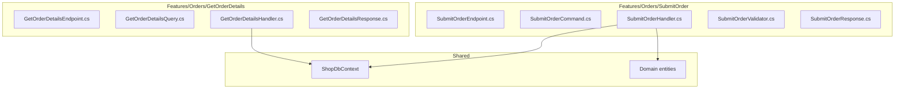

Every layered pattern we have looked at in this series, [N-Layered](/en/posts/code-structure-n-layered/), [UI / Repositories / Services](/en/posts/code-structure-ui-repos-services/), and [Clean Architecture](/en/posts/code-structure-clean-architecture/), shares the same core assumption: the right way to split code is by *technical role*. Controllers over here, services over there, repositories in the back, entities in the middle. It is so ingrained in the .NET community that most developers never question it.

Vertical Slicing questions it directly. Its claim is simple: **features change together, so they should live together**. When you ship "submit an order", you touch a controller, a service, a validator, a query, a response DTO, and probably a database call. In a horizontal layout, those six pieces live in six different folders. In a vertical slice, they live in one. The idea was formalized by Jimmy Bogard around 2018, building on his experience with MediatR and CQRS in real .NET codebases, as a reaction to how much friction layered architectures added to everyday feature work.

## Why this pattern exists

Picture a sprint planning. The team picks up four stories: "export invoices", "refund an order", "send a welcome email", and "mark a product as featured". In a horizontal architecture, each story crosses five folders. Two developers working on two stories end up editing `OrderService.cs` at the same time, resolving merge conflicts in a file neither of them fully owns. A third developer reuses a method in `OrderRepository` that was tuned for a different feature, and a subtle bug ships. Code review takes longer because reviewers have to jump between seven files to follow a single change. None of this is anyone's fault: it is the cost of organizing code by technical role when the work arrives feature by feature.

The insight is that layered architectures optimize for the *axis of reuse*, which is rarely the axis of *change*. Features change. Layers do not. So why are we organizing around layers?

Vertical Slicing flips the default:

1. **Each feature owns its own folder** with everything it needs: request, handler, validator, response.
2. **Cross-feature reuse is the exception**, not the rule. Duplication is acceptable when it isolates changes.
3. **Abstractions emerge from patterns**, not from preemptive interface gardening.

## Overview: the shape of a slice

Before the code, here is how a vertical slice sits in a .NET project:



Two features, two folders, everything you need to ship one feature in one place. The only shared code is the `DbContext` and the domain entities, and that is on purpose.

> 💡 **Info** : Vertical Slice Architecture was popularized by Jimmy Bogard, the creator of MediatR and AutoMapper. It is not a formal specification. It is a set of principles you apply with judgment, and the folder layout is just the visible part.

## Zoom: a real slice, end to end

Let us write the `SubmitOrder` feature as a single self-contained slice using Minimal APIs, MediatR, and FluentValidation. Everything lives in `Features/Orders/SubmitOrder/`.

```csharp
// Features/Orders/SubmitOrder/SubmitOrderCommand.cs
public sealed record SubmitOrderCommand(Guid OrderId) : IRequest<SubmitOrderResponse>;

// Features/Orders/SubmitOrder/SubmitOrderResponse.cs
public sealed record SubmitOrderResponse(Guid OrderId, string Status, decimal Total);

// Features/Orders/SubmitOrder/SubmitOrderValidator.cs
public sealed class SubmitOrderValidator : AbstractValidator<SubmitOrderCommand>
{
    public SubmitOrderValidator()
    {
        RuleFor(x => x.OrderId).NotEmpty();
    }
}

// Features/Orders/SubmitOrder/SubmitOrderHandler.cs
public sealed class SubmitOrderHandler
    : IRequestHandler<SubmitOrderCommand, SubmitOrderResponse>
{
    private readonly ShopDbContext _db;
    private readonly IPaymentGateway _payments;

    public SubmitOrderHandler(ShopDbContext db, IPaymentGateway payments)
    {
        _db = db;
        _payments = payments;
    }

    public async Task<SubmitOrderResponse> Handle(
        SubmitOrderCommand cmd, CancellationToken ct)
    {
        var order = await _db.Orders
            .Include(o => o.Lines)
            .FirstOrDefaultAsync(o => o.Id == cmd.OrderId, ct)
            ?? throw new NotFoundException($"Order {cmd.OrderId} not found.");

        order.Submit();

        var charge = await _payments.ChargeAsync(
            order.CustomerId, order.Total, ct);
        if (!charge.Success)
            throw new PaymentFailedException(charge.Error);

        await _db.SaveChangesAsync(ct);

        return new SubmitOrderResponse(
            order.Id, order.Status.ToString(), order.Total.Amount);
    }
}

// Features/Orders/SubmitOrder/SubmitOrderEndpoint.cs
public static class SubmitOrderEndpoint
{
    public static void MapSubmitOrder(this IEndpointRouteBuilder app)
    {
        app.MapPost("/orders/{id:guid}/submit", async (
            Guid id,
            ISender mediator,
            CancellationToken ct) =>
        {
            var response = await mediator.Send(new SubmitOrderCommand(id), ct);
            return Results.Ok(response);
        })
        .WithName("SubmitOrder")
        .WithTags("Orders");
    }
}
```

Five files, one folder, one feature. If you need to understand the whole flow, open the folder and read top to bottom. If you need to change how an order is submitted, every line you will touch is within one directory. No grep tour.

> ✅ **Good practice** : Keep the request, validator, handler, and response as `sealed` types scoped to the feature. Do not expose them outside. If another feature needs the same concept, it is often a sign you should not reuse: write a new command with the shape that fits the new use case.

## Zoom: the query side is even simpler

Reads do not need to go through the domain model. A vertical slice query can project directly from EF Core (or Dapper) into the exact response shape. No repository, no mapper, no DTO assembly line.

```csharp
// Features/Orders/GetOrderDetails/GetOrderDetailsQuery.cs
public sealed record GetOrderDetailsQuery(Guid OrderId)
    : IRequest<GetOrderDetailsResponse>;

// Features/Orders/GetOrderDetails/GetOrderDetailsResponse.cs
public sealed record GetOrderDetailsResponse(
    Guid Id,
    string CustomerName,
    decimal Total,
    string Status,
    IReadOnlyList<LineDto> Lines);

public sealed record LineDto(string ProductName, int Quantity, decimal Subtotal);

// Features/Orders/GetOrderDetails/GetOrderDetailsHandler.cs
public sealed class GetOrderDetailsHandler
    : IRequestHandler<GetOrderDetailsQuery, GetOrderDetailsResponse>
{
    private readonly ShopDbContext _db;

    public GetOrderDetailsHandler(ShopDbContext db) => _db = db;

    public async Task<GetOrderDetailsResponse> Handle(
        GetOrderDetailsQuery q, CancellationToken ct)
    {
        return await _db.Orders
            .AsNoTracking()
            .Where(o => o.Id == q.OrderId)
            .Select(o => new GetOrderDetailsResponse(
                o.Id,
                o.Customer.Name,
                o.Lines.Sum(l => l.Quantity * l.UnitPrice),
                o.Status.ToString(),
                o.Lines.Select(l => new LineDto(
                    l.Product.Name, l.Quantity, l.Quantity * l.UnitPrice))
                    .ToList()))
            .FirstOrDefaultAsync(ct)
            ?? throw new NotFoundException($"Order {q.OrderId} not found.");
    }
}
```

One SQL query. One projection. Zero repositories. The read side does not pretend to respect the domain model, because it does not need to: there are no invariants to enforce when you are just displaying data.

> 💡 **Info** : This is the **CQRS** idea applied at slice level. Commands go through the domain (to enforce invariants). Queries bypass it (for speed and simplicity). You do not need separate databases or event sourcing to get the benefit.

> ⚠️ **It works, but...** : Resist the urge to introduce a `ReadRepository` interface for queries. It adds a layer of indirection that no other feature will ever reuse. If you want to mock it for tests, mock the `DbContext` or use an in-memory provider.

## Zoom: where abstractions still live

Vertical Slicing is not "no shared code". Some things are genuinely shared and belong outside the slices:

- **Domain entities and value objects** that carry invariants. `Order.Submit()` still lives in the domain. Slices call it.
- **Cross-cutting infrastructure**: the `DbContext`, the message bus, the email sender, the payment gateway interface.
- **Pipeline behaviors** (logging, validation, transaction) that run around every handler.

A typical project layout ends up looking like this:

```
src/
  Shop.Api/
    Features/
      Orders/
        SubmitOrder/
        GetOrderDetails/
        CancelOrder/
      Customers/
        Register/
        UpdateProfile/
    Domain/              (entities, value objects)
    Infrastructure/      (DbContext, EF configs, external clients)
    Common/              (pipeline behaviors, problem details, result types)
    Program.cs
```

Notice the absence of `Controllers/`, `Services/`, and `Repositories/` folders. Those shapes are emergent per feature, not enforced at the project level.

> ✅ **Good practice** : Add a MediatR pipeline behavior for validation so every handler gets FluentValidation for free. One file in `Common/`, every slice benefits, no slice has to wire it up.

```csharp
// Common/Behaviors/ValidationBehavior.cs
public sealed class ValidationBehavior<TRequest, TResponse>
    : IPipelineBehavior<TRequest, TResponse>
    where TRequest : IRequest<TResponse>
{
    private readonly IEnumerable<IValidator<TRequest>> _validators;

    public ValidationBehavior(IEnumerable<IValidator<TRequest>> validators)
        => _validators = validators;

    public async Task<TResponse> Handle(
        TRequest request,
        RequestHandlerDelegate<TResponse> next,
        CancellationToken ct)
    {
        if (!_validators.Any()) return await next();

        var context = new ValidationContext<TRequest>(request);
        var failures = (await Task.WhenAll(_validators
                .Select(v => v.ValidateAsync(context, ct))))
            .SelectMany(r => r.Errors)
            .Where(f => f is not null)
            .ToList();

        if (failures.Count != 0)
            throw new ValidationException(failures);

        return await next();
    }
}
```

## The duplication question

Vertical Slicing will make you write code that looks duplicated. Two slices will both query orders by id. Two handlers will both read `ShopDbContext`. A junior developer will ask "should we extract this into a helper?" The answer, nine times out of ten, is **no**.

Duplication is cheap. Coupling is expensive. The moment you extract a shared method used by two slices, the slices stop being independent: changing one without checking the other becomes impossible. A few duplicated lines of EF Core are a feature, not a bug. They let slice A evolve without breaking slice B.

Extract only when:

- You find the same pattern in **three or more** slices.
- The pattern is genuinely stable and has a clear name.
- Extracting removes real risk, not just lines.

> ❌ **Never do this** : Avoid building a `BaseHandler<TCommand, TResponse>` with protected helpers shared across features. It looks clean on day one, and by month six any change to the base class affects every slice at once, which is exactly the coupling Vertical Slicing is trying to avoid. Keep each slice independently deletable.

## Where Vertical Slicing starts to bite

No pattern is free. The failure modes of Vertical Slicing are different from the layered patterns, and you should know them:

- **No enforced domain boundaries**: nothing stops a handler from bypassing a domain method and mutating an entity directly. You need discipline or architecture tests to keep invariants where they belong.
- **Discoverability for newcomers**: a dev used to "I need to change the order service, I open `OrderService.cs`" has to learn a new mental model. "I need to change how orders are submitted, I open `Features/Orders/SubmitOrder/`."
- **Cross-slice coordination**: when a business rule spans four features, you have four places to update. Good naming and domain events help, but it is real work.
- **Weak affordance for very small apps**: if you have fifteen endpoints and no real domain, a vertical slice layout feels like overkill. UI / Repos / Services is probably still the right call.

Vertical Slicing shines on medium-to-large applications with active teams, where features change often and two developers on two features must not step on each other.

## Wrap-up

You now know what Vertical Slicing actually is: organizing your codebase by feature so that everything needed to ship one change lives in one place. You can write self-contained slices with command, handler, validator, and endpoint; bypass the domain on read paths for simpler queries; keep genuinely shared concerns in a thin `Common` or `Infrastructure` folder; and resist the temptation to deduplicate prematurely. You can also tell when this pattern fits and when a more traditional layering is still the right answer.

Ready to level up your next project or share it with your team? See you in the next one, a++ 👋

## Related articles

- [N-Layered Architecture in .NET: The Foundation You Need to Master](/en/posts/code-structure-n-layered/)
- [UI / Repositories / Services: The Pragmatic .NET Layering](/en/posts/code-structure-ui-repos-services/)
- [Clean Architecture in .NET: Dependencies Pointing the Right Way](/en/posts/code-structure-clean-architecture/)

## References

- [Common web application architectures, Microsoft Learn](https://learn.microsoft.com/en-us/dotnet/architecture/modern-web-apps-azure/common-web-application-architectures)
- [Minimal APIs in ASP.NET Core, Microsoft Learn](https://learn.microsoft.com/en-us/aspnet/core/fundamentals/minimal-apis)
- [MediatR on GitHub](https://github.com/jbogard/MediatR)
- [FluentValidation documentation](https://docs.fluentvalidation.net/)
- [Entity Framework Core, Microsoft Learn](https://learn.microsoft.com/en-us/ef/core/)
