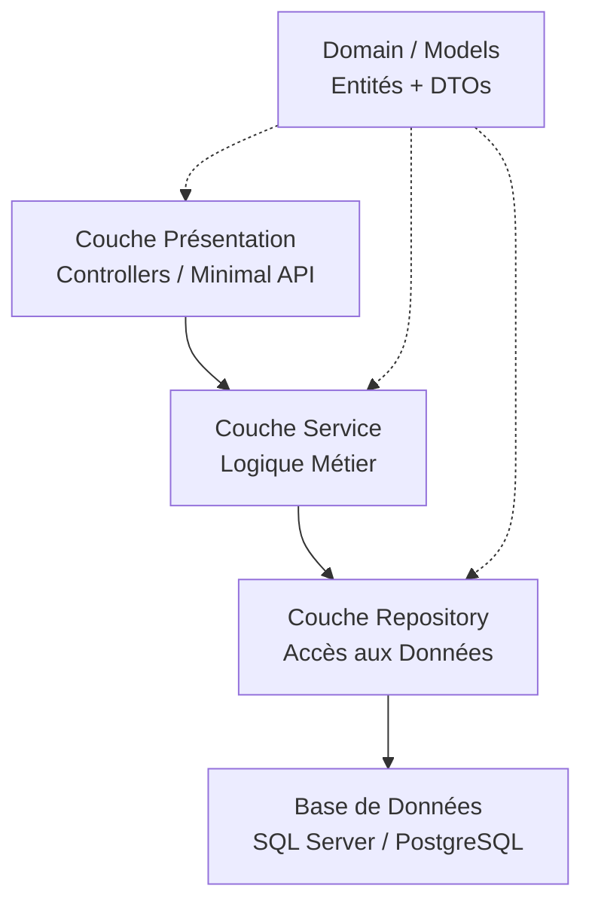

Hello tous le monde, aujourd'hui on va démystifier l'**architecture N-Couches** en .NET.

C'est probablement le premier pattern que tu as croisé dans ta carrière. Il est partout —
dans les codebases legacy, les tutos YouTube, les projets d'entreprise. Avant de passer à
Clean Architecture ou au Vertical Slicing, faut vraiment comprendre celui-là. Pas juste le
suivre bêtement, mais savoir *pourquoi* il existe, *où* il tient la route, et *quand* il
commence à faire mal.

## Le contexte — pourquoi ça existe

Imagine : tu rejoins un projet. Le codebase, c'est un seul projet Web. Les controllers
font des requêtes directement en base. La logique métier vit dans des `if` imbriqués dans
les action methods. Un bug dans le calcul de facturation t'oblige à toucher le même fichier
qui génère le HTML de la facture. Un nouveau dev casse la logique de paiement en corrigeant
un label dans l'UI.

C'est le spaghetti classique. L'architecture N-Couches existe précisément pour éviter ça.

Le principe : découper les responsabilités en couches horizontales qui ne peuvent parler
qu'à la couche directement en dessous. Chaque couche a un seul job.

Ce que ça t'apporte :
1. **Séparation des responsabilités** — l'UI ne touche jamais la base directement
2. **Testabilité** — la logique métier est isolée, testable sans lancer un serveur HTTP
3. **Remplaçabilité** — tu peux swapper Entity Framework pour Dapper sans toucher ta couche service

## Vue d'ensemble — les briques

Avant de rentrer dans le code, voici les grandes briques de l'architecture N-Couches :



| Couche | Responsabilité | Contenu typique |
|---|---|---|
| Présentation | HTTP, mapping DTOs, réponses | Controllers, Minimal API |
| Service | Règles métier | `OrderService`, `InvoiceService` |
| Repository | Abstraction de l'accès aux données | `IOrderRepository`, impl EF Core / Dapper |
| Domain/Models | Contrats partagés | Entités, DTOs, Enums, Interfaces |

## Zoom technique — brique par brique

### Domain / Models — le contrat partagé

C'est pas vraiment une "couche" au sens strict — c'est un projet partagé que tout le monde
référence. Garde-le léger : entités, DTOs, enums, et les interfaces de repositories/services.

```csharp
// Domain/Entities/Order.cs
public class Order
{
    public Guid Id { get; init; }
    public string CustomerId { get; init; } = default!;
    public List<OrderLine> Lines { get; init; } = new();
    public OrderStatus Status { get; init; }
    public decimal Total => Lines.Sum(l => l.Quantity * l.UnitPrice);
}

// Domain/DTOs/CreateOrderRequest.cs
public record CreateOrderRequest(
    string CustomerId,
    List<OrderLineDto> Lines
);
```

> 💡 **Info** — Les DTOs voyagent entre les couches. Les entités vivent en base. Ne retourne
> jamais une entité EF brute depuis un controller — tu risques d'exposer des champs internes
> et de casser ton contrat d'API dès que ton schéma change.

---

### Couche Repository — l'accès aux données, rien d'autre

Le pattern repository encapsule ta technologie d'accès aux données. L'interface vit dans
Domain ; l'implémentation vit dans Infrastructure.

```csharp
// Domain/Interfaces/IOrderRepository.cs
public interface IOrderRepository
{
    Task<Order?> GetByIdAsync(Guid id, CancellationToken ct = default);
    Task<IReadOnlyList<Order>> GetByCustomerAsync(string customerId, CancellationToken ct = default);
    Task AddAsync(Order order, CancellationToken ct = default);
    Task SaveChangesAsync(CancellationToken ct = default);
}

// Infrastructure/Repositories/OrderRepository.cs
public class OrderRepository : IOrderRepository
{
    private readonly AppDbContext _db;

    public OrderRepository(AppDbContext db) => _db = db;

    public async Task<Order?> GetByIdAsync(Guid id, CancellationToken ct = default)
        => await _db.Orders
            .AsNoTracking()
            .Include(o => o.Lines)
            .FirstOrDefaultAsync(o => o.Id == id, ct);

    public async Task AddAsync(Order order, CancellationToken ct = default)
        => await _db.Orders.AddAsync(order, ct);

    public Task SaveChangesAsync(CancellationToken ct = default)
        => _db.SaveChangesAsync(ct);
}
```

> ✅ **Bonne pratique** — Utilise toujours `AsNoTracking()` pour les requêtes en lecture seule.
> EF Core ne suivra pas l'entité dans le change tracker, ce qui réduit la consommation mémoire
> et accélère les lectures.

> ❌ **Ne jamais faire** — N'expose pas `IQueryable<T>` depuis ton interface de repository.
> Ça fait remonter l'abstraction EF Core dans ta couche service et crée un couplage fort
> que tu regretteras lors de ta prochaine migration de framework.

---

### Couche Service — c'est ici que vit la logique métier

C'est ici que tes règles métier habitent. Pas dans les controllers, pas dans les repositories.
Le service reçoit une demande, valide, applique les règles, appelle le repository, retourne
un résultat.

```csharp
// Application/Services/OrderService.cs
public class OrderService
{
    private readonly IOrderRepository _orders;
    private readonly ILogger<OrderService> _logger;

    public OrderService(IOrderRepository orders, ILogger<OrderService> logger)
    {
        _orders = orders;
        _logger = logger;
    }

    public async Task<Guid> CreateOrderAsync(
        CreateOrderRequest request, CancellationToken ct = default)
    {
        if (!request.Lines.Any())
            throw new ValidationException("Une commande doit avoir au moins une ligne.");

        var order = new Order
        {
            Id = Guid.NewGuid(),
            CustomerId = request.CustomerId,
            Status = OrderStatus.Pending,
            Lines = request.Lines.Select(l => new OrderLine
            {
                ProductId = l.ProductId,
                Quantity = l.Quantity,
                UnitPrice = l.UnitPrice
            }).ToList()
        };

        await _orders.AddAsync(order, ct);
        await _orders.SaveChangesAsync(ct);

        _logger.LogInformation("Commande {OrderId} créée pour le client {CustomerId}",
            order.Id, order.CustomerId);

        return order.Id;
    }
}
```

> ⚠️ **Ça marche, mais...** — Lancer une `ValidationException` directement dans le service
> c'est acceptable pour les cas simples. Dans une codebase plus large, envisage le Result
> pattern pour éviter d'utiliser les exceptions comme mécanisme de contrôle de flux.
> Voir la série Error Handling pour aller plus loin.

---

### Couche Présentation — des controllers fins, c'est tout

Les controllers doivent être fins. Leur seul job : recevoir la requête HTTP, appeler le
service, mapper le résultat en réponse HTTP. Zéro logique métier ici.

```csharp
// Api/Controllers/OrdersController.cs
[ApiController]
[Route("api/[controller]")]
public class OrdersController : ControllerBase
{
    private readonly OrderService _orderService;

    public OrdersController(OrderService orderService)
        => _orderService = orderService;

    [HttpPost]
    [ProducesResponseType(typeof(CreateOrderResponse), StatusCodes.Status201Created)]
    [ProducesResponseType(StatusCodes.Status400BadRequest)]
    public async Task<IActionResult> CreateOrder(
        [FromBody] CreateOrderRequest request, CancellationToken ct)
    {
        var orderId = await _orderService.CreateOrderAsync(request, ct);
        return CreatedAtAction(nameof(GetOrder), new { id = orderId },
            new CreateOrderResponse(orderId));
    }

    [HttpGet("{id:guid}")]
    public async Task<IActionResult> GetOrder(Guid id, CancellationToken ct)
    {
        var order = await _orderService.GetOrderAsync(id, ct);
        return order is null ? NotFound() : Ok(order);
    }
}
```

> ✅ **Bonne pratique** — Utilise `CancellationToken` dans chaque action async et passe-le
> jusqu'à la couche base de données. Quand un utilisateur annule sa requête ou qu'un load
> balancer timeout, EF Core annulera la requête SQL plutôt que de la laisser tourner pour rien.

---

### Structure de la solution

MyApp.sln
├── src/
│   ├── MyApp.Api/              ← Présentation (Controllers, Program.cs, DI)
│   ├── MyApp.Application/      ← Services (logique métier)
│   ├── MyApp.Infrastructure/   ← Repositories, EF Core, intégrations externes
│   └── MyApp.Domain/           ← Entités, DTOs, Interfaces (aucune dépendance)
└── tests/
├── MyApp.Application.Tests/
└── MyApp.Infrastructure.Tests/

> 💡 **Info** — `MyApp.Domain` doit avoir **zéro** dépendance NuGet externe. Si tu te
> retrouves à ajouter EF Core ou n'importe quel framework dans Domain, c'est que le sens
> de tes dépendances est mauvais.

---

## Où l'architecture N-Couches commence à te freiner

Ce pattern fonctionne très bien pour les applications petites à moyennes. Il commence à
montrer ses limites quand le codebase grossit :

- **Services anémiques** — Tu te retrouves avec un `ProductService` qui a 25 méthodes, une
  par cas d'usage. Impossible à naviguer.
- **Repositories obèses** — Ils accumulent des méthodes de requêtes custom jusqu'à devenir
  ingérables.
- **Couplage inter-fonctionnalités** — Ajouter une nouvelle feature oblige à toucher chaque
  couche à chaque fois.

C'est pas une raison de fuir le N-Couches — c'est un signal d'évolution. La suite naturelle,
c'est la Clean Architecture (qui enforce la direction des dépendances) ou le Vertical Slicing
(qui organise par feature plutôt que par couche).

## Wrap-up

Tu sais maintenant ce qu'est l'architecture N-Couches, comment chaque couche s'articule avec
les autres, et comment l'implémenter correctement dans une vraie solution .NET. Tu peux
structurer un nouveau projet from scratch, garder tes controllers fins, isoler la logique
métier dans les services, et abstraire l'accès aux données derrière des interfaces de repository.

Prêt à booster ton prochain projet ou à le partager avec ton équipe ? À la prochaine, a++ 👋

## Références

- [Architectures d'applications web courantes — Microsoft Learn](https://learn.microsoft.com/fr-fr/dotnet/architecture/modern-web-apps-azure/common-web-application-architectures)
- [Style d'architecture N-Tier — Azure Architecture Center](https://learn.microsoft.com/fr-fr/azure/architecture/guide/architecture-styles/n-tier)
- [Fondamentaux ASP.NET Core — Microsoft Learn](https://learn.microsoft.com/fr-fr/aspnet/core/fundamentals/)
- [Entity Framework Core — Microsoft Learn](https://learn.microsoft.com/fr-fr/ef/core/)