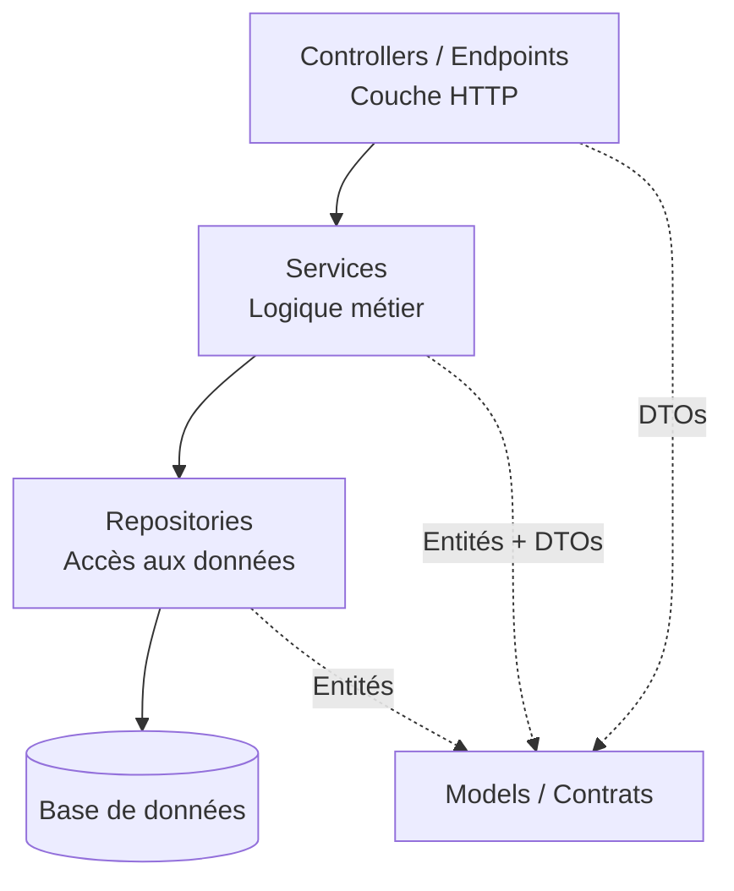

Hello tous le monde, aujourd'hui on va explorer le découpage **UI / Repositories / Services**, probablement le pattern de structure de code que tu as le plus croisé dans ta carrière .NET.

Avant que Clean Architecture devienne un buzzword et avant que le Vertical Slicing s'invite à toutes les confs, il y avait un pattern plus humble qui a livré des milliers d'applications .NET en silence : **UI, Services, Repositories**. Trois dossiers, trois responsabilités, un seul projet. Si tu as déjà ouvert un codebase ASP.NET Core de taille moyenne, il y a de fortes chances que ce soit ce que tu y as trouvé.

Attention, c'est pas exactement la même chose que l'architecture N-Couches, même si les deux termes se mélangent souvent dans les conversations. Le N-Couches, c'est une séparation *physique* en plusieurs projets, avec des règles de dépendances vérifiées par le compilateur. UI / Repos / Services, c'est une séparation *logique* à l'intérieur d'un seul projet. Plus léger, plus rapide à mettre en place, et parfaitement adapté à un paquet d'applications. Ça a aussi des modes de défaillance très spécifiques qu'il faut savoir reconnaître avant qu'ils ne pourrissent ton code.

## Le contexte : pourquoi ce pattern existe

Imaginons que nous ayons une petite équipe qui construit un outil interne. Un seul projet ASP.NET Core, une trentaine d'endpoints, une base de données. Créer quatre csproj, tricoter les références entre projets et débattre de savoir si `AutoMapper` va dans Infrastructure ou dans Application, c'est de l'overkill. Ce qu'il faut vraiment à cette équipe, c'est :

1. **Un endroit pour le HTTP**, pour que les controllers restent lisibles.
2. **Un endroit pour la logique métier**, pour arrêter de debugger à travers six fichiers juste pour comprendre une règle.
3. **Un endroit pour l'accès aux données**, pour que changer une requête n'oblige pas à toucher l'UI.

Trois dossiers. Trois suffixes. Fini. C'est ça le deal : juste assez de structure pour arrêter la pourriture, pas assez pour ralentir la livraison.

## Vue d'ensemble : les trois boîtes

Avant de rentrer dans le code, voici les grandes briques de ce découpage :



| Dossier | Rôle | Fichiers typiques |
|---|---|---|
| `Controllers/` | Recevoir le HTTP, valider la forme, appeler un service | `OrdersController.cs` |
| `Services/` | Orchestrer les règles métier, appeler les repositories | `OrderService.cs`, `IOrderService.cs` |
| `Repositories/` | Abstraire la base | `OrderRepository.cs`, `IOrderRepository.cs` |
| `Models/` | Entités, DTOs, enums | `Order.cs`, `CreateOrderRequest.cs` |

Tout vit dans un seul projet. Pas de gymnastique de solution, pas de références circulaires, pas de débat d'une heure sur où doit vivre une extension d'`ILogger`.

## Zoom technique : brique par brique

### Structure dans un seul projet

```
MyApp.Api/
├── Controllers/
│   └── OrdersController.cs
├── Services/
│   ├── IOrderService.cs
│   └── OrderService.cs
├── Repositories/
│   ├── IOrderRepository.cs
│   └── OrderRepository.cs
├── Models/
│   ├── Entities/
│   │   └── Order.cs
│   └── Dtos/
│       ├── CreateOrderRequest.cs
│       └── OrderResponse.cs
├── Data/
│   └── AppDbContext.cs
└── Program.cs
```

> 💡 **Info** : Ce n'est pas "mal parce que c'est un seul projet". Des milliers d'applis en prod tournent comme ça. La règle est appliquée par les dossiers et les interfaces, pas par des frontières csproj.

### Repositories : le seam d'accès aux données

Un repository, c'est une classe ennuyeuse qui emballe EF Core (ou Dapper) et expose des méthodes nommées d'après les cas d'usage, pas d'après le SQL. C'est l'interface qui sert de point de couplage pour le reste de l'appli.

```csharp
// Repositories/IOrderRepository.cs
public interface IOrderRepository
{
    Task<Order?> GetByIdAsync(Guid id, CancellationToken ct = default);
    Task<IReadOnlyList<Order>> GetPendingForCustomerAsync(string customerId, CancellationToken ct = default);
    Task AddAsync(Order order, CancellationToken ct = default);
    Task<int> SaveChangesAsync(CancellationToken ct = default);
}

// Repositories/OrderRepository.cs
public sealed class OrderRepository : IOrderRepository
{
    private readonly AppDbContext _db;

    public OrderRepository(AppDbContext db) => _db = db;

    public Task<Order?> GetByIdAsync(Guid id, CancellationToken ct = default) =>
        _db.Orders
            .AsNoTracking()
            .Include(o => o.Lines)
            .FirstOrDefaultAsync(o => o.Id == id, ct);

    public async Task<IReadOnlyList<Order>> GetPendingForCustomerAsync(
        string customerId, CancellationToken ct = default) =>
        await _db.Orders
            .AsNoTracking()
            .Where(o => o.CustomerId == customerId && o.Status == OrderStatus.Pending)
            .ToListAsync(ct);

    public async Task AddAsync(Order order, CancellationToken ct = default) =>
        await _db.Orders.AddAsync(order, ct);

    public Task<int> SaveChangesAsync(CancellationToken ct = default) =>
        _db.SaveChangesAsync(ct);
}
```

> ✅ **Bonne pratique** : Nomme tes méthodes de repository d'après l'intention, pas d'après la requête SQL. `GetPendingForCustomerAsync` dit à l'appelant *pourquoi*. `GetByCustomerIdAndStatusAsync` fait remonter le filtre dans le nom et finit par générer une explosion combinatoire de surcharges.

> ❌ **Ne jamais faire** : N'expose pas `IQueryable<Order>` depuis l'interface. Le jour où un controller ou un service commence à chaîner `.Where().Include().OrderBy()`, ton repository n'est plus un seam, c'est juste un wrapper fin au-dessus de `DbSet`. Tu as perdu toutes les raisons d'avoir introduit cette abstraction.

### Services : là où vivent les règles

Un service dépend d'un ou plusieurs repositories et contient les règles métier. Pas de types HTTP (`IActionResult`, `HttpContext`), pas de types EF Core (`IQueryable`, `DbSet`). Juste ton domaine et les interfaces.

```csharp
// Services/IOrderService.cs
public interface IOrderService
{
    Task<Guid> CreateAsync(CreateOrderRequest request, CancellationToken ct = default);
    Task<OrderResponse?> GetAsync(Guid id, CancellationToken ct = default);
}

// Services/OrderService.cs
public sealed class OrderService : IOrderService
{
    private readonly IOrderRepository _orders;
    private readonly IProductRepository _products;
    private readonly ILogger<OrderService> _logger;

    public OrderService(
        IOrderRepository orders,
        IProductRepository products,
        ILogger<OrderService> logger)
    {
        _orders = orders;
        _products = products;
        _logger = logger;
    }

    public async Task<Guid> CreateAsync(CreateOrderRequest request, CancellationToken ct = default)
    {
        if (request.Lines.Count == 0)
            throw new ValidationException("Une commande doit avoir au moins une ligne.");

        var productIds = request.Lines.Select(l => l.ProductId).ToHashSet();
        var products = await _products.GetManyAsync(productIds, ct);

        if (products.Count != productIds.Count)
            throw new ValidationException("Un ou plusieurs produits n'existent pas.");

        var order = new Order
        {
            Id = Guid.NewGuid(),
            CustomerId = request.CustomerId,
            Status = OrderStatus.Pending,
            CreatedAt = DateTime.UtcNow,
            Lines = request.Lines
                .Select(l => new OrderLine
                {
                    ProductId = l.ProductId,
                    Quantity = l.Quantity,
                    UnitPrice = products[l.ProductId].Price
                })
                .ToList()
        };

        await _orders.AddAsync(order, ct);
        await _orders.SaveChangesAsync(ct);

        _logger.LogInformation("Commande {OrderId} créée pour {CustomerId}",
            order.Id, order.CustomerId);

        return order.Id;
    }

    public async Task<OrderResponse?> GetAsync(Guid id, CancellationToken ct = default)
    {
        var order = await _orders.GetByIdAsync(id, ct);
        return order?.ToResponse();
    }
}
```

> ✅ **Bonne pratique** : Un service peut dépendre de plusieurs repositories. C'est l'endroit naturel pour orchestrer un workflow du genre "vérifier le stock produit, créer la commande, publier un événement". Le jour où un service commence à dépendre d'un autre service, arrête-toi et demande-toi si cette collaboration cachée n'est pas en fait un seul cas d'usage déguisé.

> ⚠️ **Ça marche, mais...** : Lever une `ValidationException`, c'est très bien pour les petites applis. Dès que tu as plus d'une poignée de chemins de validation, le Result pattern vaut sa cérémonie. C'est couvert dans la série Error Handling.

### Controllers : fins, ennuyeux, prévisibles

Les controllers doivent être les fichiers les moins intéressants du projet. Recevoir, appeler, retourner.

```csharp
// Controllers/OrdersController.cs
[ApiController]
[Route("api/orders")]
public sealed class OrdersController : ControllerBase
{
    private readonly IOrderService _orders;

    public OrdersController(IOrderService orders) => _orders = orders;

    [HttpPost]
    [ProducesResponseType(typeof(CreatedResponse), StatusCodes.Status201Created)]
    [ProducesResponseType(typeof(ProblemDetails), StatusCodes.Status400BadRequest)]
    public async Task<IActionResult> Create(
        [FromBody] CreateOrderRequest request, CancellationToken ct)
    {
        var id = await _orders.CreateAsync(request, ct);
        return CreatedAtAction(nameof(Get), new { id }, new CreatedResponse(id));
    }

    [HttpGet("{id:guid}")]
    [ProducesResponseType(typeof(OrderResponse), StatusCodes.Status200OK)]
    [ProducesResponseType(StatusCodes.Status404NotFound)]
    public async Task<IActionResult> Get(Guid id, CancellationToken ct)
    {
        var order = await _orders.GetAsync(id, ct);
        return order is null ? NotFound() : Ok(order);
    }
}
```

> ✅ **Bonne pratique** : Si une action de controller fait plus de 5 à 10 lignes, c'est que quelque chose a fuité du service. Fais-le redescendre.

### Le câblage dans `Program.cs`

Tout est enregistré une fois, en général scoped par requête pour que la durée de vie du `DbContext` colle.

```csharp
var builder = WebApplication.CreateBuilder(args);

builder.Services.AddDbContext<AppDbContext>(opt =>
    opt.UseNpgsql(builder.Configuration.GetConnectionString("Default")));

// Repositories
builder.Services.AddScoped<IOrderRepository, OrderRepository>();
builder.Services.AddScoped<IProductRepository, ProductRepository>();

// Services
builder.Services.AddScoped<IOrderService, OrderService>();

builder.Services.AddControllers();
builder.Services.AddProblemDetails();

var app = builder.Build();
app.UseExceptionHandler();
app.MapControllers();
app.Run();
```

> 💡 **Info** : Disponible depuis .NET 8, `AddProblemDetails()` combiné à `UseExceptionHandler()` te donne des réponses d'erreur RFC 7807 sans rien écrire de custom. Pas besoin de middleware maison pour le cas général.

## UI / Repos / Services vs N-Couches : ce qui change vraiment

Sur un diagramme, ça se ressemble. La différence est physique :

| Aspect | UI / Repos / Services | N-Couches |
|---|---|---|
| Projets | 1 | 3 ou 4 (`Api`, `Application`, `Infrastructure`, `Domain`) |
| Règles de dépendances | Respectées à la review | Respectées par le compilateur |
| Temps de mise en place | Quelques minutes | Un après-midi |
| Coût d'un refactor | Déplacer des fichiers | Déplacer des fichiers + corriger les csproj |
| Idéal pour | Petites et moyennes applis, solo ou petite équipe | Applis multi-équipes ou contraintes fortes |

La version mono-projet n'est pas un petit cousin honteux. C'est le bon compromis pour une énorme partie du travail qu'on fait vraiment. Passe à la saveur N-Couches multi-projets seulement quand l'enforcement par le compilateur est en train de te rapporter plus qu'il ne te coûte.

## Où ça commence à faire mal

Les mêmes modes de défaillance que le N-Couches, mais amplifiés par l'absence de garde-fou du compilateur :

- **Services obèses** : `OrderService` finit avec 30 méthodes parce que chaque nouveau endpoint ajoute une méthode plutôt qu'une classe.
- **Fuites dans les repositories** : quelqu'un ajoute un `GetOrdersForAdminDashboardWithFiltersAndSortingAsync` et plus personne n'ose le découper.
- **Couplage inter-services** : `OrderService` appelle `InvoiceService`, qui appelle `NotificationService`, qui appelle `OrderService`. Bienvenue dans le cycle.
- **Dérive des DTOs** : sans projet `Domain` pour tenir la ligne, DTOs et entités commencent à se référencer dans les deux sens.

Quand ces symptômes apparaissent, la réponse n'est pas "ajouter plus de dossiers". C'est soit passer à une vraie Clean Architecture (pour enforcer la direction), soit au Vertical Slicing (pour arrêter d'organiser par rôle technique).

## Wrap-up

Tu sais maintenant ce qu'est vraiment le pattern UI / Repositories / Services, en quoi il diffère du N-Couches formel, et comment le câbler proprement dans un seul projet ASP.NET Core. Tu peux choisir ce découpage en conscience pour tes petites et moyennes applis, garder tes controllers fins, isoler ton accès aux données derrière des méthodes de repository nommées par intention, et reconnaître le moment exact où il arrête de te rendre service.

Prêt à booster ton prochain projet ou à le partager avec ton équipe ? À la prochaine, a++ 👋

## Pour aller plus loin

- [L'architecture N-Couches en .NET : les fondations que tu dois maîtriser](/fr/posts/code-structure-n-layered/)

## Références

- [Architectures d'applications web courantes, Microsoft Learn](https://learn.microsoft.com/fr-fr/dotnet/architecture/modern-web-apps-azure/common-web-application-architectures)
- [Injection de dépendances dans ASP.NET Core, Microsoft Learn](https://learn.microsoft.com/fr-fr/aspnet/core/fundamentals/dependency-injection)
- [Problem Details pour les API HTTP dans ASP.NET Core, Microsoft Learn](https://learn.microsoft.com/fr-fr/aspnet/core/fundamentals/error-handling)
- [Entity Framework Core, Microsoft Learn](https://learn.microsoft.com/fr-fr/ef/core/)
