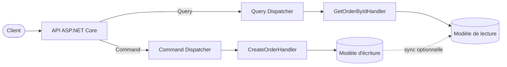

Hello tous le monde, aujourd'hui on va démystifier **CQRS**, cet acronyme qu'on entend dans toutes les discussions d'architecture et qu'on confond souvent avec l'event sourcing, les bases séparées, ou le fameux "il faut utiliser MediatR". Prenons le temps de remettre les choses au clair.

## 1. Le contexte : pourquoi ça existe

À la fin des années 80, Bertrand Meyer formalise dans *Object-Oriented Software Construction* le principe de **Command Query Separation (CQS)** : une méthode doit soit effectuer une action (commande), soit retourner une donnée (query), jamais les deux. Simple, élégant, et largement ignoré en pratique.

Avance rapide jusqu'en 2010. Greg Young pousse l'idée d'un cran : au lieu de séparer les méthodes sur un même objet, on sépare carrément le **modèle**. Un modèle optimisé pour l'écriture, un autre pour la lecture. Il baptise ça **Command Query Responsibility Segregation**, CQRS.

Pourquoi c'est devenu une affaire ? Parce que le pattern classique du "gros service" finit toujours par craquer :

```csharp
public class OrderService
{
    public async Task<OrderDto> CreateOrder(CreateOrderDto dto) { /* ... */ }
    public async Task<OrderDto> GetOrderById(Guid id) { /* ... */ }
    public async Task<List<OrderSummaryDto>> SearchOrders(OrderFilter f) { /* ... */ }
    public async Task CancelOrder(Guid id) { /* ... */ }
    public async Task<OrderReportDto> GetMonthlyReport(int y, int m) { /* ... */ }
    // ... et 20 autres méthodes
}
```

Supposons que nous regardions ce service honnêtement : les lectures et les écritures n'ont rien à voir. Les écritures se soucient des invariants, de la validation, des transactions, des règles métier. Les lectures, elles, se soucient de la forme, de la projection, de la performance, du cache. Les mélanger dans un seul service transforme chaque évolution en merge conflict et chaque DTO en compromis.

CQRS règle ça en te donnant deux voies distinctes.

## 2. Vue d'ensemble : les briques

Avant de rentrer dans le code, voici les grandes briques de CQRS :

- **Commands** : une intention de modifier l'état. `CreateOrderCommand`, `CancelOrderCommand`. Elles ne renvoient rien d'intéressant, ou juste un identifiant.
- **Queries** : une intention de lire l'état. `GetOrderByIdQuery`. Elles ne mutent jamais rien.
- **Handlers** : un handler par commande ou query. Responsabilité unique.
- **Dispatcher** : route une commande ou une query vers son handler. Ça peut être MediatR, un dispatcher maison, ou rien du tout.



> 💡 **Info** : La flèche en pointillés est optionnelle. CQRS n'impose pas deux bases. Un seul `DbContext` EF Core qui tape sur le même SQL Server, c'est du CQRS tout à fait valide.

## 3. Zoom technique

### 3.1 Les contrats

On commence par des interfaces marqueurs légères. Avec MediatR 12.x, `IRequest<T>` fait déjà le boulot, mais gardons nos propres alias pour la lisibilité :

```csharp
using MediatR;

public interface ICommand : IRequest { }
public interface ICommand<TResponse> : IRequest<TResponse> { }
public interface IQuery<TResponse> : IRequest<TResponse> { }

public interface ICommandHandler<TCommand> : IRequestHandler<TCommand>
    where TCommand : ICommand { }

public interface ICommandHandler<TCommand, TResponse> : IRequestHandler<TCommand, TResponse>
    where TCommand : ICommand<TResponse> { }

public interface IQueryHandler<TQuery, TResponse> : IRequestHandler<TQuery, TResponse>
    where TQuery : IQuery<TResponse> { }
```

> ✅ **Bonne pratique** : Ces alias ne coûtent rien et rendent l'intention lisible au point d'appel. `IQueryHandler<GetOrderByIdQuery, OrderDto>` se lit beaucoup mieux qu'un `IRequestHandler<...>` générique.

### 3.2 Une vraie commande : créer une commande métier

```csharp
public sealed record CreateOrderCommand(
    Guid CustomerId,
    IReadOnlyList<OrderLineInput> Lines,
    string ShippingAddress) : ICommand<Guid>;

public sealed record OrderLineInput(Guid ProductId, int Quantity);

public sealed class CreateOrderCommandHandler
    : ICommandHandler<CreateOrderCommand, Guid>
{
    private readonly AppDbContext _db;
    private readonly IPricingService _pricing;
    private readonly ILogger<CreateOrderCommandHandler> _logger;

    public CreateOrderCommandHandler(
        AppDbContext db,
        IPricingService pricing,
        ILogger<CreateOrderCommandHandler> logger)
    {
        _db = db;
        _pricing = pricing;
        _logger = logger;
    }

    public async Task<Guid> Handle(
        CreateOrderCommand request,
        CancellationToken ct)
    {
        var customer = await _db.Customers
            .FirstOrDefaultAsync(c => c.Id == request.CustomerId, ct)
            ?? throw new CustomerNotFoundException(request.CustomerId);

        if (request.Lines.Count == 0)
            throw new DomainException("Une commande doit contenir au moins une ligne.");

        var productIds = request.Lines.Select(l => l.ProductId).ToArray();
        var products = await _db.Products
            .Where(p => productIds.Contains(p.Id))
            .ToDictionaryAsync(p => p.Id, ct);

        var order = Order.Create(customer.Id, request.ShippingAddress);
        foreach (var line in request.Lines)
        {
            if (!products.TryGetValue(line.ProductId, out var product))
                throw new ProductNotFoundException(line.ProductId);

            var price = await _pricing.GetUnitPriceAsync(product, customer, ct);
            order.AddLine(product.Id, line.Quantity, price);
        }

        _db.Orders.Add(order);
        await _db.SaveChangesAsync(ct);

        _logger.LogInformation("Commande {OrderId} créée pour le client {CustomerId}",
            order.Id, customer.Id);

        return order.Id;
    }
}
```

Remarque bien : le handler porte tout le use case. Validation, règles métier, persistance, logging. Rien ne fuit vers une couche "service" fourre-tout.

> ⚠️ **Ça marche, mais...** : On est souvent tenté de renvoyer un `OrderDto` complet depuis la commande. À éviter. Renvoie juste l'identifiant, et laisse l'appelant lancer une query s'il a besoin de la représentation complète. Mélanger écriture et lecture dans un même handler, c'est exactement ce que CQRS cherche à éviter.

### 3.3 Une vraie query

Les queries doivent court-circuiter le modèle de domaine et projeter directement vers un DTO :

```csharp
public sealed record GetOrderByIdQuery(Guid OrderId) : IQuery<OrderDetailsDto?>;

public sealed record OrderDetailsDto(
    Guid Id,
    string CustomerName,
    string Status,
    decimal Total,
    DateTime CreatedAt,
    IReadOnlyList<OrderLineDto> Lines);

public sealed record OrderLineDto(
    string ProductName,
    int Quantity,
    decimal UnitPrice,
    decimal LineTotal);

public sealed class GetOrderByIdQueryHandler
    : IQueryHandler<GetOrderByIdQuery, OrderDetailsDto?>
{
    private readonly AppDbContext _db;

    public GetOrderByIdQueryHandler(AppDbContext db) => _db = db;

    public Task<OrderDetailsDto?> Handle(
        GetOrderByIdQuery request,
        CancellationToken ct)
    {
        return _db.Orders
            .AsNoTracking()
            .Where(o => o.Id == request.OrderId)
            .Select(o => new OrderDetailsDto(
                o.Id,
                o.Customer.FullName,
                o.Status.ToString(),
                o.Lines.Sum(l => l.UnitPrice * l.Quantity),
                o.CreatedAt,
                o.Lines.Select(l => new OrderLineDto(
                    l.Product.Name,
                    l.Quantity,
                    l.UnitPrice,
                    l.UnitPrice * l.Quantity)).ToList()))
            .FirstOrDefaultAsync(ct);
    }
}
```

> ✅ **Bonne pratique** : `AsNoTracking` sur le chemin de lecture est presque toujours la bonne réponse. Tu projettes vers un DTO, il n'y a rien à tracker.

> ❌ **Ne jamais faire** : Ne charge pas l'agrégat `Order` complet pour ensuite le mapper en mémoire vers un DTO. Ça gaspille le change tracker, ça ramène des colonnes inutiles, et ça couple ton modèle de lecture à ton modèle d'écriture. Projette directement dans la query.

### 3.4 Le câblage dans ASP.NET Core

On enregistre MediatR et on dispatch depuis des minimal APIs :

```csharp
var builder = WebApplication.CreateBuilder(args);

builder.Services.AddDbContext<AppDbContext>(opt =>
    opt.UseSqlServer(builder.Configuration.GetConnectionString("Default")));

builder.Services.AddMediatR(cfg =>
    cfg.RegisterServicesFromAssemblyContaining<CreateOrderCommandHandler>());

builder.Services.AddScoped<IPricingService, PricingService>();

var app = builder.Build();

app.MapPost("/orders", async (
    CreateOrderCommand command,
    IMediator mediator,
    CancellationToken ct) =>
{
    var id = await mediator.Send(command, ct);
    return Results.Created($"/orders/{id}", new { id });
});

app.MapGet("/orders/{id:guid}", async (
    Guid id,
    IMediator mediator,
    CancellationToken ct) =>
{
    var result = await mediator.Send(new GetOrderByIdQuery(id), ct);
    return result is null ? Results.NotFound() : Results.Ok(result);
});

app.Run();
```

> 💡 **Info** : Disponible à partir de MediatR 12 : `RegisterServicesFromAssemblyContaining<T>` remplace l'ancienne surcharge `AddMediatR(typeof(T))`.

### 3.5 Ce que CQRS n'est PAS

C'est là que la plupart des équipes se perdent :

- **CQRS n'impose pas deux bases de données.** Tu peux faire du CQRS contre un seul SQL Server. La séparation est dans le code, pas dans l'infra.
- **CQRS n'impose pas l'event sourcing.** L'event sourcing est un pattern totalement séparé qui se marie bien avec CQRS, mais aucun des deux n'implique l'autre.
- **CQRS n'impose pas MediatR.** Tu peux dispatcher tes commandes et queries via une interface maison, un source generator, ou juste de la DI classique. MediatR est simplement une librairie pratique.
- **CQRS n'est pas "du DDD".** Tu peux appliquer CQRS à une app CRUD sans prétention et tirer quand même de la valeur du split lecture/écriture.

> ⚠️ **Ça marche, mais...** : Si ton app est un pur CRUD formulaire sur base de données sans règles métier, CQRS ne t'apportera probablement rien. Le surcoût de deux types par opération n'en vaut la peine que quand les lectures et les écritures divergent vraiment.

## 4. Wrap-up

CQRS est une discipline structurelle : un modèle pour écrire, un modèle pour lire, et aucun handler qui fait les deux boulots à la fois. Né du CQS de Meyer, généralisé par Greg Young, il tient la charge parce qu'il arrête de forcer un seul modèle mental à servir deux workloads radicalement différents.

Tu sais maintenant d'où vient CQRS, la différence entre CQS et CQRS, comment modéliser tes commandes et tes queries avec MediatR en ASP.NET Core, et quels mythes ignorer. Tu peux commencer à refactorer un gros service en handlers focalisés dès aujourd'hui, et tu peux le faire sans toucher à la topologie de ta base.

Prêt à booster ton prochain projet ou à le partager avec ton équipe ?
À la prochaine, a++ 👋

## Références

- [Microsoft Learn : pattern CQRS](https://learn.microsoft.com/fr-fr/azure/architecture/patterns/cqrs)
- [Microsoft Learn : vue d'ensemble des minimal APIs ASP.NET Core](https://learn.microsoft.com/fr-fr/aspnet/core/fundamentals/minimal-apis/overview)
- [Microsoft Learn : requêtes no-tracking EF Core](https://learn.microsoft.com/fr-fr/ef/core/querying/tracking)
- [Dépôt GitHub MediatR](https://github.com/jbogard/MediatR)
